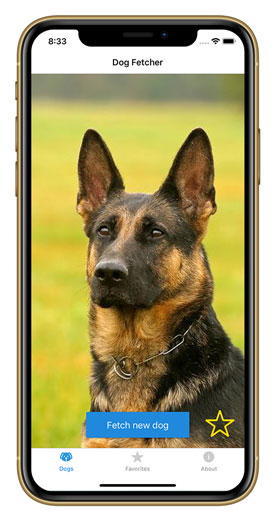
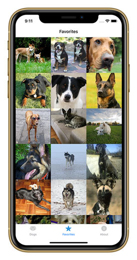
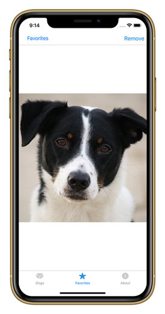
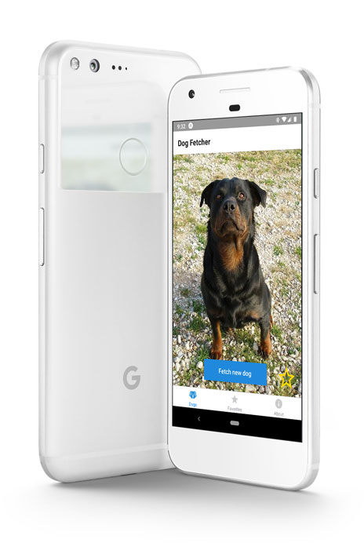

# Dog Fetcher

_Dog Fetcher_ brings random cute dogs to your device at the push of a button! Save the good boys/girls to your device and look at them through the "Favorites" tab. Download to your device now through [Expo](https://expo.io/@derekhouck/dog-fetcher).

## Features

- New random dog appears whenever the "Fetch new dog" button is pressed
- Pressing the star button saves the dog as a favorite
- Favorites tab displays all of the user's favorite dogs
- View individual favorites and remove dogs from the favorites list

## Tech Stack

- [React Native](https://facebook.github.io/react-native/)
- [Expo](https://expo.io/)
- [React Navigation](https://reactnavigation.org/)
- [Redux](https://redux.js.org/)
- [Dog API](https://dog.ceo/dog-api/)

## Screenshots

Homescreen

Favorites

Single Favorite

iPad (landscape orientation)

Android

## History

_Dog Fetcher_ is my first React Native app and was created during Flex Week for [Thinkful's Engineering Immersion program](https://www.thinkful.com/bootcamp/web-development/full-time/). Some lessons learned:

- React Native is just that: React used to build native apps. If you have experience building React web apps, it's very easy to transfer that experience over to building React Native apps. The challenge is knowing when something is different. You will get comfortable as you code and suddenly be looking at a red screen of death because you used a method or component that only works for web apps.

- Navigating between screens takes a while to wrap your head around. React Navigation is a wonderful library and their [excellent documentation](https://reactnavigation.org/docs/en/getting-started.html) helps a lot. Start with the "Getting Started" section and continue reading until they've covered the problem you're facing. Better yet, read through the whole documentation first before you create any screens for your app.

- If you're going to store things on a user's device, set up Redux first before diving into [AsyncStorage](https://facebook.github.io/react-native/docs/asyncstorage). Make sure all your actions and reducers function correctly, then work on adding in persistence.

- [Layout](https://facebook.github.io/react-native/docs/flexbox) in React Native is implemented using Flexbox, only with a default flex direction of 'column' instead of 'row'. This will mess with you. Everything will seem reversed. If necessary, you can switch it back using `flexDirection: 'row'` or abadon Flexbox altogether with `position: 'absolute'`.